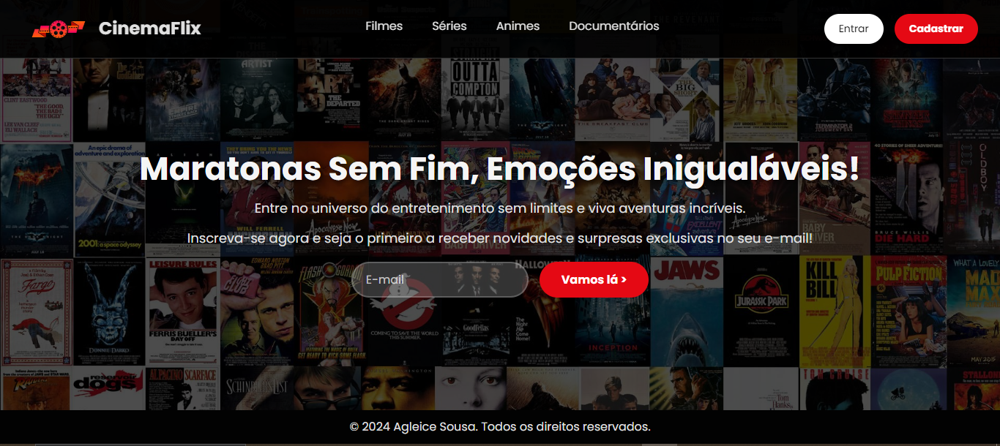
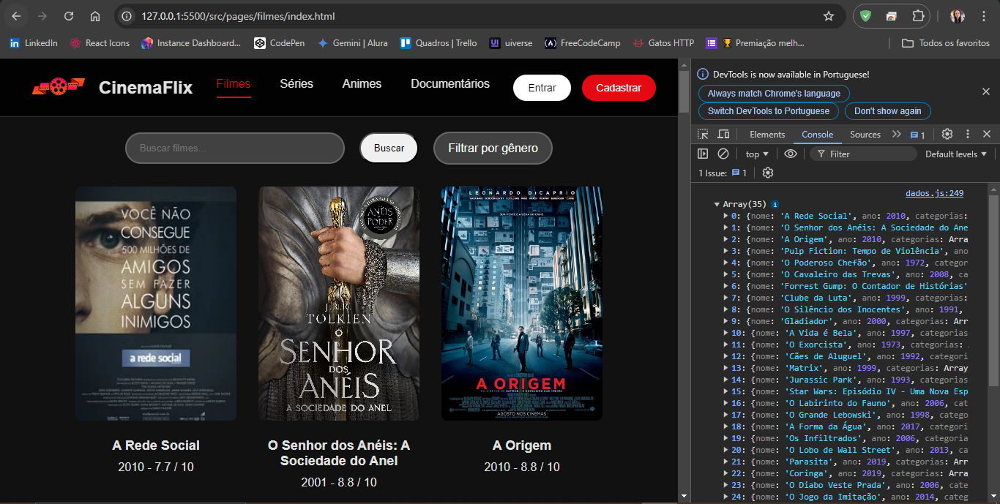

# CinemaFlix

Bem-vindo ao CinemaFlix, um projeto desenvolvido durante a Imersão DEV da Alura com Gemini. O CinemaFlix é uma plataforma de streaming fictícia que permite aos usuários explorar e descobrir filmes, séries, animes e documentários.

## 🚀 Funcionalidades

- **Interface de Usuário Atraente**: Design intuitivo e responsivo com uma página inicial cativante.
- **Sistema de Pesquisa e Filtro**: Permite a busca e filtragem de conteúdo por gênero.
- **Exibição Dinâmica de Conteúdo**: Visualização de filmes e séries em uma grade interativa.

## 🛠 Tecnologias Utilizadas

- **HTML**: Estrutura da página.
- **CSS**: Estilização e layout.
- **JavaScript**: Funcionalidade dinâmica e interação com o usuário.
- **Font Awesome**: Ícones sociais e outros ícones gráficos.

## 📁 Estrutura do Projeto

```bash
/project-root
│
├── assets
│   └── images
│       └── # Imagens utilizadas no projeto.
│
├── src
│   └── pages
│       └── filmes
│          ├── index.html
│          │      └── # Página de streaming com funcionalidades de busca e filtro.
│          │
│          ├── script.js
│          │      └── # Script para funcionalidades dinâmicas da página de streaming.
│          │
│          └── style.css
│                 └── # Arquivo de estilos para a página com a lista Filmes.
│
├── index.html
│   └── # Página inicial da plataforma CinemaFlix.
│
├── style.css
│   └── # Arquivo de estilos para a página inicial da plataforma.
│
├── script.js
│   └── # Script para funcionalidades dinâmicas da página inicial.
|
├── dados.js
│   └── # Dados dos filmes armazenados em um array JavaScript.
```

## 📑 Comentários no Código

Os arquivos de estilo e script incluem comentários que explicam as principais seções e funcionalidades do código, facilitando a compreensão e manutenção do projeto.

## 💻 Como Rodar o Projeto

1. Clone o repositório:
   
```bash
   git clone https://github.com/agleicesousa/imersao-alura.git
```

2. Navegue até o diretório do projeto:
   
```bash
   cd imersao-alura
```

3. Abra o arquivo `index.html` em seu navegador para visualizar a página inicial.

## 📸 Capturas de Tela

Aqui estão algumas capturas de tela do projeto:




## 📧 Contato

Se você tiver alguma dúvida ou feedback, sinta-se à vontade para me contatar:

- Email: agleicesousa98@gmail.com
- LinkedIn: [Agleice Sousa](https://www.linkedin.com/in/agleice-sousa)

## 🎓 Agradecimentos

Um agradecimento especial à equipe da Alura e ao Gemini pela excelente orientação durante a imersão. Foi uma experiência incrível!

## 🔗 Links Úteis

- [Imersão DEV da Alura](https://www.alura.com.br/imersao-dev-google-gemini)
